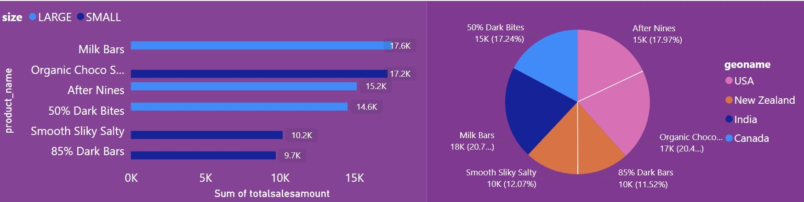

 # introduction
 
 - In this sales data analytics project, we analyze sales data to uncover valuable insights. We calculate the cost per box sold by salespeople, retrieve detailed sales information, identify top-performing teams, and determine the best-selling products. Our exploration spans regions, product sizes, and sales amounts. Whether you’re interested in individual performance or overall trends, this project provides actionable insights for data-driven decision-making.

 - Sql queryies? check  them out here [Top Sales data.sql](/Top%20Sales%20data.sql/)

 # Background
- These queries deliver a dynamic analysis of sales performance and regional trends. The first reveals the top three products by sales amount for each size, spotlighting those with odd-numbered customers and providing rich geographic insights. The second highlights the leading salesperson in each region, showcasing top performers with an alphabetized regional overview. The third offers a comprehensive look at detailed sales data and pinpoints the top 5 sales regions, emphasizing key areas of success. Lastly, the fourth query uncovers high-value transactions from Q1, focusing on significant sales from January to March and presenting them in chronological order for a clear snapshot.

Data detail from my [Sales_Analysis_Reports]()

### The Question i wanted to answer through my sql quries were 

1. How can I identify the top three products by total sales amount for each product size, considering only sales with an odd number of customers, and include geographical information, ordered by size and total sales amount in descending order?

2. How can I identify the top-performing salesperson in each geographic region based on total sales amount, and list them in alphabetical order by region name?

3. How can I retrieve detailed sales information including product and geographic data, and also identify the top 5 geographic regions by total sales amount?

4. How can I retrieve sales data for January, February, and March where the amount exceeds 7000, and order the results by sale date?

# Tools I Leveraged

- In my deep dive into the data analyst jsales market, I leveraged the power of advanced SQL techniques, PostgreSQL, Visual Studio Code, and GitHub, transforming raw data into actionable market insights.


- Structured Query Language (SQL): The bedrock of my analysis, empowering me to extract valuable insights by querying databases with precision.
- PostgreSQL: My chosen database management system, adept at handling intricate job posting data structures.
- Visual Studio Code (VS Code): My trusty companion for database management tasks and executing intricate SQL queries.
- Git & GitHub: Indispensable for version control, enabling seamless collaboration on SQL scripts and ensuring meticulous project tracking.

# The Analysis 
 - I strategically crafted SQL queries to uncover regional demand trends, evaluate sales performance, identify top-selling roles, assess acquisition channels, analyze pricing impact, and forecast future sales, driving actionable business insights.

 ### 1. How can I identify the top three products by total sales amount for each product size, considering only sales with an odd number of customers, and include geographical information, ordered by size and total sales amount in descending order?
- This query finds the top three products by sales for each size, focusing on odd-customer transactions, ranked by sales amount, and includes geographic details, ordered by size and sales amount.

 ```sql
WITH OddCustomerSales AS (
    SELECT 
        s.SPID,
        s.GeoID,
        s.PID,
        s.SaleDate,
        s.Amount,
        s.Customers,
        s.Box
    FROM sales s
    WHERE s.Customers % 2 = 1
),
ProductSales AS (
    SELECT 
        p.Size,
        p.PID,
        p.Product_Name,
        s.GeoID,
        SUM(s.Amount) AS TotalSalesAmount
    FROM OddCustomerSales s
    JOIN product p ON s.PID = p.PID
    GROUP BY p.Size, p.PID, p.Product_Name, s.GeoID
),
RankedProducts AS (
    SELECT 
        Size,
        PID,
        Product_Name,
        GeoID,
        TotalSalesAmount,
        ROW_NUMBER() OVER (PARTITION BY Size ORDER BY TotalSalesAmount DESC) AS rn
    FROM ProductSales
)
SELECT 
    rp.Size,
    rp.PID,
    rp.Product_Name,
    rp.TotalSalesAmount,
    g.GeoName,
    g.Region
FROM RankedProducts rp
JOIN geo g ON rp.GeoID = g.GeoID
WHERE rp.rn <= 3
ORDER BY rp.Size, rp.TotalSalesAmount DESC;
```
- Top Products by Size: The query identifies the top three products for each product size based on total sales amount. This helps in understanding which products are the most successful within each size category.

- Sales Performance with Odd Customer Numbers: The query focuses exclusively on sales transactions where the number of customers is odd, offering insights into how these specific sales contribute to overall performance.

- Geographic Sales Insights: By including geographic information, the query allows for analysis of where the top-selling products are most popular, aiding in regional sales strategy development.

- Product Ranking and Trends: The use of ranking within each product size category provides a clear view of which products consistently perform well, highlighting potential trends in customer preferences based on product size and location.



* stacked bar chart (left) comparing sales of different product sizes (LARGE vs. SMALL) and a pie chart (right) illustrating sales distribution by geography (USA, New Zealand, India, Canada). Key products include Milk Bars and Organic Choco S., with sales figures highlighted for both size and region.

### 2. How can I identify the top-performing salesperson in each geographic region based on total sales amount, and list them in alphabetical order by region name?
- This query identifies the top salesperson in each region by total sales, ranks them, and retrieves the highest performer, with results sorted alphabetically by region name.

```sql
WITH RankedSales AS (
    SELECT 
        g.GeoName, 
        p.spid, 
        p.SalesPerson_name, 
        SUM(s.Amount) AS TotalSalesAmount,
        ROW_NUMBER() OVER (PARTITION BY g.GeoName ORDER BY SUM(s.Amount) DESC) AS rn
    FROM sales s
    JOIN people p ON s.SPID = p.SPID
    JOIN geo g ON s.GeoID = g.GeoID
    GROUP BY g.GeoName, p.spid, p.SalesPerson_name
)
SELECT 
    GeoName, 
    spid, 
    SalesPerson_name, 
    TotalSalesAmount
FROM RankedSales
WHERE rn = 1
ORDER BY GeoName;
```
- Top Salesperson by Region: The query identifies the top-performing salesperson in each geographic region based on total sales amount. This helps in recognizing the most successful sales representatives in different areas.

- Salesperson Ranking: By ranking salespeople within each region, the query provides insights into how individual salespeople compare to their peers in terms of performance.

- Regional Sales Success: The results are sorted alphabetically by region name, allowing for easy comparison of top sales performers across different geographic areas. This can inform regional sales strategies and resource allocation.


| geoname     | spid | salesperson_name | totalsalesamount |
|-------------|------|------------------|------------------|
| Australia   | SP10 | Brien Boise      | 15,596           |
| Canada      | SP08 | Ches Bonnell     | 14,562           |
| India       | SP16 | Marney O'Breen   | 13,620           |
| New Zealand | SP18 | Madelene Upcott  | 19,229           |
| UK          | SP04 | Wilone O'Kielt   | 14,853           |
| USA         | SP23 | Van Tuxwell      | 17,248           |


### 3.How can I retrieve detailed sales information including product and geographic data, and also identify the top 5 geographic regions by total sales amount?

- The first query provides comprehensive sales details with product and regional insights, while the second reveals the top 5 regions driving the highest sales, highlighting key areas of success.
```sql
SELECT 
    s.SaleDate, 
    s.Amount, 
    s.Customers, 
    s.Box,
    p.Product_name, 
    p.Category, 
    p.Size, 
    p.Cost_per_box,
    g.GeoName, 
    g.Region
FROM sales s
JOIN product p ON s.PID = p.PID
JOIN geo g ON s.GeoID = g.GeoID;

SELECT 
    g.GeoName, 
    SUM(s.Amount) AS "Total Sales Amount"
FROM sales s
JOIN geo g ON s.GeoID = g.GeoID
GROUP BY g.GeoName
ORDER BY "Total Sales Amount" DESC
LIMIT 5;
```
- Detailed Sales Insights: The first query provides a comprehensive view of sales data, including the sale date, amount, number of customers, and product details such as name, category, size, and cost. It also includes geographic information, offering a clear picture of sales performance across different products and regions.

- Top Performing Regions: The second query identifies the top 5 geographic regions based on total sales amount, highlighting which regions contribute the most to overall sales. This information is crucial for understanding regional market strengths and optimizing sales strategies.

- Product and Regional Performance: By combining detailed sales data with regional performance insights, the queries together allow for a deep analysis of how different products are performing in specific regions and where the highest sales are concentrated.

| geoname     | Total Sales Amount |
|-------------|--------------------|
| Australia   | 86,549             |
| USA         | 84,271             |
| India       | 77,853             |
| Canada      | 75,470             |
| New Zealand | 66,290             |

### 4.How can I retrieve sales data for January, February, and March where the amount exceeds 7000, and order the results by sale date?
- This query filters sales data for January, February, and March with amounts over 7000, ordering results by sale date to highlight significant transactions in the first quarter of the year.
```sql
SELECT 
    quarter1_sales.SPID,
    quarter1_sales.GeoID,
    quarter1_sales.PID,
    quarter1_sales.SaleDate::DATE,
    quarter1_sales.Amount,
    quarter1_sales.Customers,
    quarter1_sales.Box
FROM (
    SELECT * FROM sales WHERE EXTRACT(MONTH FROM SaleDate) = 1  -- January sales
    UNION ALL
    SELECT * FROM sales WHERE EXTRACT(MONTH FROM SaleDate) = 2  -- February sales
    UNION ALL
    SELECT * FROM sales WHERE EXTRACT(MONTH FROM SaleDate) = 3  -- March sales
) AS quarter1_sales
WHERE quarter1_sales.Amount > 7000
ORDER BY quarter1_sales.SaleDate;
```
- High-Value Q1 Transactions: The query filters for sales data from January, February, and March where the sale amount exceeds 7000, focusing on significant transactions in the first quarter of the year.

- Detailed Transaction Overview: It provides a detailed view of high-value transactions, including sale date, amount, number of customers, and product and geographic identifiers.

- Transaction Trends: By ordering results by sale date, the query helps identify trends and patterns in high-value sales throughout the first quarter, enabling better analysis of peak periods and sales performance.

| spid | geoid | pid | saledate   | amount  | customers | box |
|------|-------|-----|------------|---------|-----------|-----|
| SP01 | E1    | P04 | 2021-01-01 | 8414.00 | 276       | 495 |
| SP06 | E1    | P01 | 2021-01-01 | 12894.00| 115       | 478 |
| SP10 | E5    | P06 | 2021-01-01 | 15596.00| 32        | 975 |
| SP06 | E2    | P11 | 2021-01-01 | 8561.00 | 111       | 330 |
| SP25 | E3    | P05 | 2021-01-01 | 14273.00| 335       | 752 |
| SP09 | E2    | P07 | 2021-01-01 | 7553.00 | 67        | 280 |
| SP18 | E4    | P21 | 2021-01-04 | 19229.00| 64        | 1013|
| SP19 | E1    | P19 | 2021-01-04 | 7539.00 | 502       | 943 |
| SP23 | E2    | P16 | 2021-01-05 | 17248.00| 163       | 664 |
| SP17 | E4    | P13 | 2021-01-05 | 9730.00 | 361       | 573 |
| SP18 | E6    | P12 | 2021-01-05 | 7063.00 | 250       | 643 |
| SP07 | E3    | P11 | 2021-01-05 | 7399.00 | 420       | 275 |
| SP13 | E5    | P22 | 2021-01-06 | 7182.00 | 29        | 378 |
| SP11 | E5    | P20 | 2021-01-06 | 10122.00| 296       | 614 |
| SP05 | E2    | P12 | 2021-01-06 | 7123.00 | 63        | 195 |
| SP10 | E3    | P15 | 2021-01-06 | 8500.00 | 229       | 380 |
| SP24 | E5    | P02 | 2021-01-06 | 11238.00| 23        | 690 |
| SP04 | E6    | P12 | 2021-01-07 | 8476.00 | 5         | 451 |
| SP05 | E1    | P06 | 2021-01-07 | 8705.00 | 189       | 492 |
| SP10 | E4    | P20 | 2021-01-07 | 10193.00| 325       | 532 |
| SP16 | E1    | P07 | 2021-01-07 | 13620.00| 304       | 960 |
| SP08 | E3    | P02 | 2021-01-07 | 14562.00| 15        | 755 |
| SP23 | E5    | P18 | 2021-01-07 | 12450.00| 192       | 629 |
| SP11 | E1    | P05 | 2021-01-07 | 7645.00 | 115       | 351 |
| SP04 | E1    | P01 | 2021-01-07 | 7085.00 | 48        | 353 |

# What I Learn 

### Identifying Top Products by Sales for Each Size:

- Process: Filter sales with an odd number of customers, then aggregate sales by product and size, rank products within each size by total sales amount, and finally, select the top three products per size.
- Key Insights: This method helps you determine the top-selling products within each size category, considering only those sales that involved an odd number of customers. You also gain geographical insights by including additional location data.

### Finding Top-Performing Salespeople by Region:

- Process: Aggregate sales data by salesperson within each geographic region, rank salespeople by total sales amount, and select the top performer per region. Results are then sorted alphabetically by region name.
- Key Insights: This approach identifies the top salesperson in each region based on their total sales, which can aid in performance evaluation and resource allocation.

### Retrieving Detailed Sales and Top 5 Regions by Sales Amount:

- Process: Join sales data with product and geographic information to retrieve detailed sales records. Additionally, aggregate total sales by geographic region, sort regions by sales amount, and select the top 5 regions.
- Key Insights: You obtain detailed insights into sales transactions and product information while also identifying the regions with the highest sales volumes.

### Filtering Sales Data for Specific Months:

- Process: Extract sales data for January, February, and March where the amount exceeds 7000, and order the results by the sale date.
- Key Insights: This technique helps in analyzing high-value sales transactions within the first quarter of the year, providing a focused view of significant sales activities during these months.

# Conclusions 
### Closing Thoughts

-This set of queries delivers a thorough and insightful analysis of sales performance. The first query highlights the top three products by total sales amount for each size category, focusing on transactions with an odd number of customers and integrating geographical data for a detailed view of regional performance. The second query pinpoints the leading salesperson in each region, showcasing top sales talent and allowing for a comparative regional assessment. The third query combines detailed sales data with product and geographic information, and identifies the top five regions by total sales amount—essential for strategic planning and performance evaluation. Finally, the fourth query filters high-value sales transactions from January, February, and March, presenting a chronological view for effective seasonal analysis. Collectively, these queries offer a dynamic and comprehensive perspective on sales trends and performance, aiding in informed decision-making and strategic growth.
